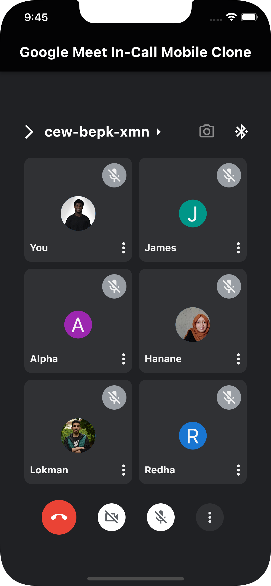

# google_meet_mobile_interface_clone

I was on a Google Meet call yesterday, during the process of the call, I got inspired by how the Interface of the Google Meet Mobile Interface looked, and decided to clone it.

## Interface Description

The Interface is pretty basic, no logical functionalities are iplemented, But it is a good starting point for a new project.

I was able to implement the logic to pick the first letter of the name of any of the persons in the call, and then to pick a random color for the background if an Image is not provided.

### App Preview

